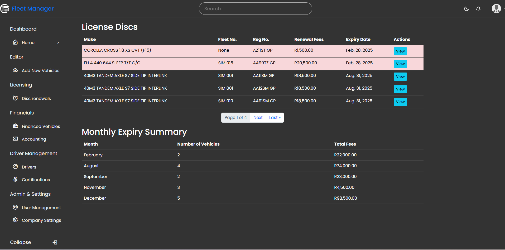
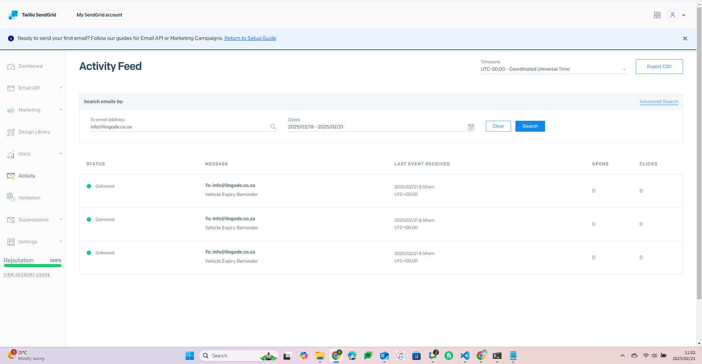
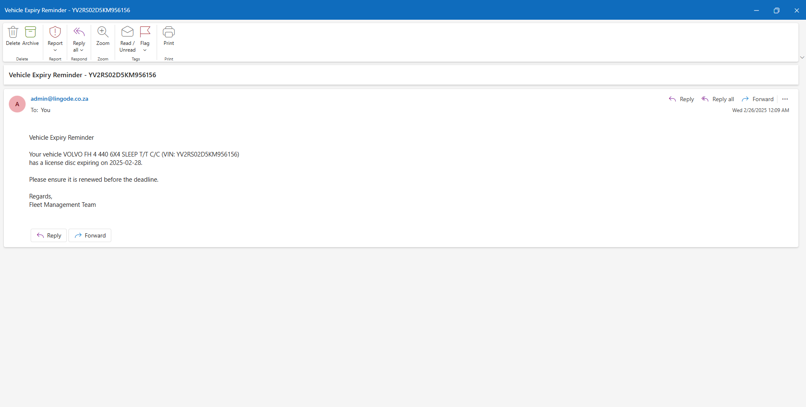

# Fleet Manager - A Vehicle Management System

## Description

Fleet Manager is a web-based application designed to help organizations manage their vehicle assets efficiently. Users can add vehicles, track purchase details, monitor expiry dates for discounts, and receive email reminders. The app ensures streamlined fleet management with an intuitive interface and automated notifications.

## Features

- **User Authentication**: Secure login and user management.
- **Vehicle Management**: Add, update, and delete vehicle assets.
- **Purchase Details Tracking**: Store invoice details, purchase dates, and dealership information.
- **Discount Expiry Alerts**: Automatic email notifications for approaching discount expiry dates.
- **Task Scheduling**: Uses Django-Q for background task execution.
- **Search Functionality**: Easily find vehicles by VIN, make, or model.

## Technologies Used

- **Frontend**: HTML, CSS (Bootstrap), JavaScript
- **Backend**: Django
- **Database**: MySQL
- **Task Scheduling**: Django-Q
- **Email Notifications**: SendGrid

## Installation

1. Clone the repository:
   ```bash
   git clone https://github.com/simminda/fleet-manager.git
   cd fleet-manager
   ```
2. Create a virtual environment and activate it:
   ```bash
   python -m venv venv
   source venv/bin/activate  # On Windows use: venv\Scripts\activate
   ```
3. Install dependencies:
   ```bash
   pip install -r requirements.txt
   ```
4. Set up MySQL and configure `settings.py` accordingly:
   ```python
   DATABASES = {
       'default': {
           'ENGINE': 'django.db.backends.mysql',
           'NAME': 'your_database_name',
           'USER': 'your_database_user',
           'PASSWORD': 'your_database_password',
           'HOST': 'localhost',
           'PORT': '3306',
       }
   }
   ```
5. Apply database migrations:
   ```bash
   python manage.py migrate
   ```
6. Create a superuser:
   ```bash
   python manage.py createsuperuser
   ```
7. Start the development server:
   ```bash
   python manage.py runserver
   ```
8. Start Django-Q cluster:
   ```bash
   python manage.py qcluster
   ```
9. Access the app at `http://127.0.0.1:8000/`.

## Usage

- Log in to the system.
- Add vehicle assets and enter their purchase details.
- The system automatically sends email reminders when a discount is nearing expiry.
- Search for vehicles using their VIN, make, or model.
- Monitor and manage fleet assets effectively.

## To-Do

- Implement role-based access control for different user levels.
- Create a better landing page/dashboard for quick analytics on fleet data.
- Improve UI styling for better user experience.
- Implement all features listed in Sidebar.
- Add image property for assets and allow uploading.
- Give more asset and renewal details in the email notification

## License

This project is open-source and available under the [MIT License](LICENSE).

## Author

Developed by Simphiwe Ndaba.

## Acknowledgments

This project was inspired by the need for efficient fleet management solutions and was developed as part of Simphiwe's CS50W journey.


## Screenshots

### Assets Listing


### Adding an Asset


### Asset View


### Licence Discs tracking


### SendGrid Integration


### Expiry reminder emails
